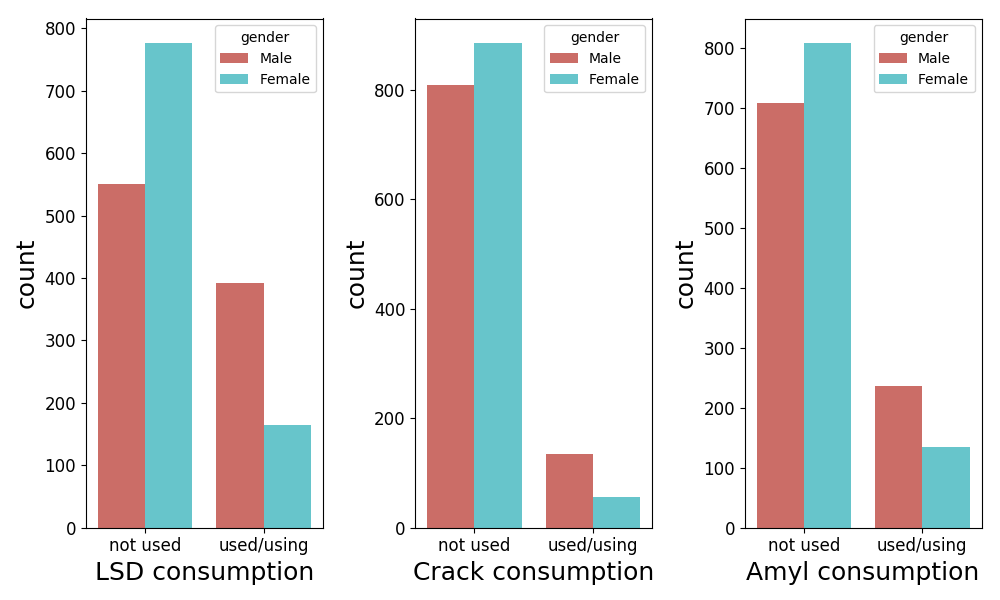
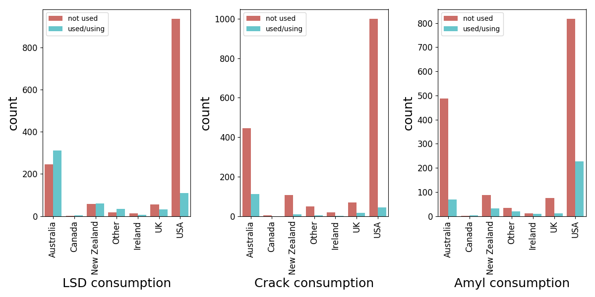

```{r library loading, echo = FALSE}
#suppressMessages(library(tidyverse))
library(knitr)
```

# Who is "High"?: Predicting Drug Usage

Hatice Cavusoglu

## Abstract

Drug addiction is one of the most serious issues the society is facing today. Those consuming illicit drugs have higher chances of mental and physical illnesses and earlier mortality. However, the consequences of drug addiction does not only apply to the addicts. Families emotionally and financially suffer. Unarguably, societies bear tangible and intangible costs of addictions. Understanding the reasons of the initial drug use is important from the policymakers' perspective to devise better policy interventions to combat the drug addiction. Initial drug use does not happen in isolation. Psychological, social, individual, environmental, and economic reasons have been identified ([WHO 2004](http://www.who.int/mental_health/evidence/en/prevention_of_mental_disorders_sr.pdf)). Various studies have demonstrated that personality traits are associated with the drug usage. In this report, I studied models predicting drug usage based on the personality profiles and demographics.

## Introduction

The report aims to develop models to predict the usages of three *abusable psychoactive drugs*: LSD, Crack, and Amly nitrite. "A psychoactive drug, psychopharmaceutical, or psychotropic is a chemical substance that changes brain function and results in alterations in perception, mood, consciousness or behavior".([Wikipedia](https://en.wikipedia.org/wiki/Psychoactive_drug)). Psychologists have developed various personality inventories, which are personality assessment tools based questionnaires to determine personality profiles. I will use personality traits of individuals, measured by using Neo Five Factor Inventory ([Wikipedia](https://en.wikipedia.org/wiki/Revised_NEO_Personality_Inventory)), Barratt Impulsiveness Scale ([Wikipedia](https://en.wikipedia.org/wiki/Barratt_Impulsiveness_Scale)), Sensation seeking ([Wikipedia](https://en.wikipedia.org/wiki/Sensation_seeking)) along with demographics to develop a model to predict usage for each of the three drugs. The data used is from [Fehrman et al. (2015)](https://arxiv.org/abs/1506.06297) and accessible at [UCI ML Repository](http://archive.ics.uci.edu/ml/machine-learning-databases/00373/drug_consumption.data). 

The big challenge with this dataset was that data is imbalanced. The imbalance data is the data where the classes are not represented evenly. In the dataset, there are *disproportionately* less drug users. It is known that such datasets suffer from [accuracy paradox](https://en.wikipedia.org/wiki/Accuracy_paradox). There are [various ways](https://machinelearningmastery.com/tactics-to-combat-imbalanced-classes-in-your-machine-learning-dataset/) to alleviate the adverse effects of imbalanced training data. In this report, I used an alternative metric instead of test accuracy to select the best model and generated synthetic samples. 

I investigated Logistic Regression, KNN, and Random Forest. Feature selection was conducted. Since the objective is to predict the positive class (the respondent has used the drug), I used recall rate of positive class to select the best model. When measures for personality profile and demographics are used, KNN with recursive feature elimination for LSD and Logistic Regression without recursive feature elimination for crack and Amly nitrite resulted in the best performance. The recall rates for positive class of each drug are 0.85, 0.74, and 0.77 respectively. 

While the main objective of this report was to develop a model for each drug to predict the drug usage by using personality inventory measures and demographics, I extended my analysis to see if I can improve the recall performance of each of the model. Since we have consumption information for 18 different drugs for each individual in the dataset, I thought that considering those as additional features could improve the recall performance of the models. Specifically, for each drug, along with 12 demographic and personality trait measures, I included consumption information for 17 other drugs as my initial set of features to be considered in the recursive feauture elimination. Logistic Regression with `l2` penalty for LSD, Logistic Regression with `l1` or `l2` penalty for Crack and KNN for Amyl nitrite performed best with the recursive feature elimination, by reaching 0.96, 0.85 and 0.83 recall performance respectively. However, while these three later models performed better than the initial three mdels developed using the demographics and personality traits, the recursive feature elimination resulted in elimination of all the personality traits measures from the models. That is, the resultant models use consumption of some other drugs and some demographics to predict the drug use.  

## Data

The data (Fehrman et al. 2015) consists of 1885 respondents who responded personality trait questionnaires and self-reported their central nervous system psychoactive drug consumptions. It has 12 demographic and personality trait measures and 18 drug consumptions. Consumption of a drug was measured based on the recency of use. Respondents with "Never used" and "Used over a decade ago" for a drug were categorized as "non-users" (i.e., negative class) and the others with "Used is last year", "Used is last month", "Used is last week", and "Used is last day" were categoried as "users" (i.e., positive class). Variables are standardized. I recoded gender variable as binary. The summary stats for the demographic and personality trait factors are provided in the table below.

**Table 1. Summary Statistics for Demographic and Personality Trait Measures**

```{r summary stat1, echo= FALSE, warning= FALSE, message=FALSE}
summary_personality <- read.csv("data/stat_smry_traits.csv")

#summary_personality <- summary_personality[c(1:4,8),] %>% rename(Stats=X)

kable(summary_personality)
```


For the brevity, I have focused on only three drugs representing three clusters of drugs found in (Fehrman et al. 2015): LSD, crack, and amly nitrite. The summary stats for usage of those drugs are presented in the following table.

**Table 2. Summary Statistics for Drug Consumption**

```{r summary stat2, echo= FALSE}
summary_consumption <- read.csv("data/stat_smry_consp.csv")

summary_consp_a <- data.frame("Stats" = summary_consumption$X,"LSD Consumption" = summary_consumption$lsd_consp_decade, "Crack Consumption" = summary_consumption$crack_consp_decade, "Amly Consumption" = summary_consumption$amly_consp_decade)
summary_consp_a <- summary_consp_a[c(1:4,8),]
kable(summary_consp_a)
```

To visually characterize the consumptions of these three drugs, the following plot represents consumptions of each drug by gender.

**Fig. 1. Consumption by gender**


Since the respondents were from different countries, the following plot illustrates the consumption of each drug by country.

**Figure 2. Consumption by country**


## Method

I used three algorithms in my models: Logistic Regression, KNN, and Random Forest. I am presenting 8 models summarized in Table 3.

**Table 3. Models** 

```{r method_table, echo = FALSE}

Label <-  c("A", "B", "C", "D", "E", "F", "G", "H")
Method <- c("LogisticRegression(penalty = l1)",
        "KNN()",
        "RandomForest()",
        "LogisticRegression(penalty = l2)",
        "KNN()",
        "LogisticRegression(penalty = l2)",
        "LogisticRegression(penalty = l1)",
        "KNN()")

Feature <- c("l1 regularization", "", "","RFE() + l2 regularization","RFE()","RFE() + l2 regularization","RFE()+ l1 regularization","RFE()" )
Data <- c("demographics + personality traits","demographics + personality traits","demographics + personality traits","demographics + personality traits","demographics + personality traits","demographics + personality traits + drug consumptions","demographics + personality traits + drug consumptions","demographics + personality traits + drug consumptions" )
df <-  data.frame(Label, Method, "Feature Selection"=Feature, "Data" = Data)
kable(df)
```

The first 5 models use only demographic and personality trait measures and the remaining 3 models use not only demographic and personality trait measures but also consumption information of the drugs other than the focal drug that the model aims to predict. 

In all of the models, since the dataset is imbalanced (i.e. there are disproportinately more non-user class than user class), to combat the imbalance in the target variables,  I generated synthetic training data by using *the Synthetic Minority Over-sampling Technique (SMOTE)*. By following [the best practice](https://machinelearningmastery.com/tactics-to-combat-imbalanced-classes-in-your-machine-learning-dataset/), synthetic training data was generated after the test data was set aside. 

In the models with Logistic Regression, I either used `l1` or default `l2`. When I performed feature selection, I used recursive feature elimination (RFE). For each number of features tried, RFE selects the best feature combinations. By using those selected features, model hyperparameters were optimized by using grid search. With the optimum hyperparameters obtained, I fit the model and obtained recall performance of the model on the *unseen* test data. By comparing recall performance values for different numbers of features considered, the best number of featured was obtained. By using the corresponding best combination of features and tuned hyperparameters, the final model was trained and its recall performance on the *unseen* test data was recorded.

To alleviate the [accuracy paradox](https://en.wikipedia.org/wiki/Accuracy_paradox), I used the *recall rate* of the positive class on the *unseen* test data, instead of *accuracy*, to determine the best model. That is because it is important to have a model that performs well to determine the unseen true-class cases. If the object was different, I would have used precision or ROC Area under the curve measures. 

## Results

After the analysis by following the steps described in Method section above for each model, the recall performances of different models for each of the drugs considered were obtained as presented in Table 4.

**Table 4. Recall performance of different models for each class of each drug**

```{r recall_table, echo=FALSE, fig.width=16, fig.height=6 }
Method = c("A", "B", "C", "D", "E", "F", "G", "H")
LSD_notused =  c(0.75, 0.74, 0.85, 0.76, 0.71, 0.73, 0.84, 0.77)
LSD_used = c(0.78, 0.79, 0.57, 0.79, 0.85, 0.96, 0.93, 0.95)
Crack_notused = c(0.65, 0.66, 0.95, 0.59, 0.66, 0.66, 0.80, 0.74)
Crack_used = c(0.74, 0.59, 0.15, 0.70, 0.57, 0.85, 0.85, 0.78)
AmylNitrite_notused = c(0.51, 0.62, 0.89, 0.64, 0.59, 0.59, 0.73, 0.64)
AmylNitrite_used = c(0.77, 0.55, 0.26, 0.64, 0.63, 0.83, 0.74, 0.84)
df1 = data.frame(Method, "LSD notused"=LSD_notused,"LSD used" =LSD_used,"Crack notused" =Crack_notused,"Crack used" =Crack_used,"AmylNitrite notused" = AmylNitrite_notused,"AmylNitrite used" =AmylNitrite_used)
kable(df1)
```

When *only* demographics and personality trait features are available to be used (i.e., Models A-E), KNN with recursive feature elimination for LSD (Model A) and Logistic Regression with l1 regularization (Model E) for crack and amyl performed the best. 

When consumptions of the other drugs along with demographics and personality trait measures are available to be used (i.e., Models F-G), Logistic Regression with l2 regularization and recursive feature elimination (Model F) for LSD, Logistic Regression with l1 or l2 regularization and recursive feature elimination (Model F or G), KNN with recursive feature elimination (Model H) for Amyl performed the best. 

It is important recognized that when other drug consumption information is made available, the best model for each of these drugs does not include personality trait measures. For example, Model F for LSD only uses country and information regarding usage of ecstasy, ketamine_consp_decade, and meth_consp_decade. 

The comparison of the models with and without the additional consumption data reveals the *trade-off* between *useful* and *available* features. In this case, it turned out that other drug consumption information is more useful in prediction models. However, such information may not be available; rendering the models F-G not usable. The good news is the best model without using other drug consumption information performed quite well. 

## Conclusion

Identifying the risky individuals who are likely to use abusable psychoactive drugs is important for the societies to develop appropriate prevention and intervention mechanisms. This report shows that we can use demographic and personality trait measures in ML models to predict the drug usage. For example, the recall rate of the best model for the LSD users was 0.85. When other drug usage information is included, the recall rate of the best model for the LSD users hit 0.96. While the performance grew by additional 0.11, it is important to recognize the trade-off between available and useful features. In the current setting, demographic and personality profile information can be obtained *unintrusively*. However, despite their predictive power, it is hard to obtain or know the other drugs consumption information. Therefore, models that require readily-available or easy-to-obtain information should be preferred.

## Appendix

The source code for data wrangling, exploratory data analysis and the model development for each of the models above can be found [here](../src/q4_script.ipynb).


